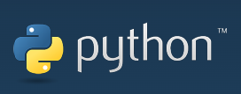
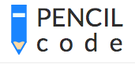

# Overview

This book offers the introductory programming concepts and exercises. It is best suited for middle school students without any prior programming experience. It is meant to supplement as a reference or reading material for an after school coding program/workshop.

**Primarily Python1 programming language is used for examples and exercises.**

The book is divided into eight lessons. Each lesson starts with a lesson plan and includes examples and exercises. The lesson plan introduces the concepts and provides examples for you to understand the concepts and try them on your own.

The examples directly relate to the lesson goals and may be tried by the students without any additional help or work.

The exercises are built on top of the concepts leant within a given lesson. We encourage students to try all the examples before trying the exercies.

1 Python programming language has a lot of information for beginners to advanced programmers. If you are curious, check out [Python website](https://www.python.org) for more information.

NOTE: No previous computer programming experience required!

